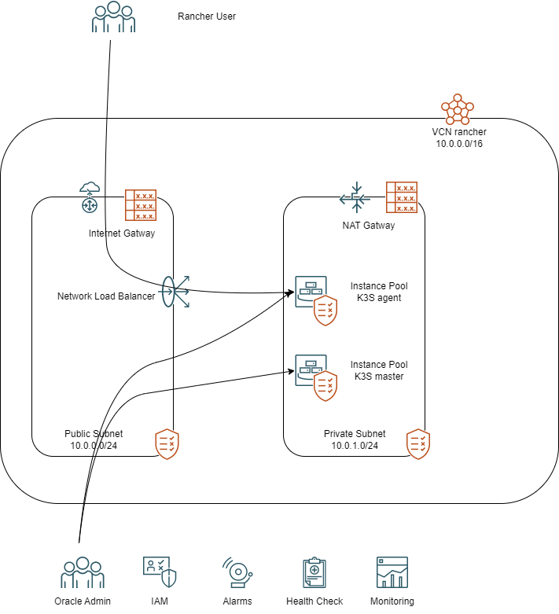
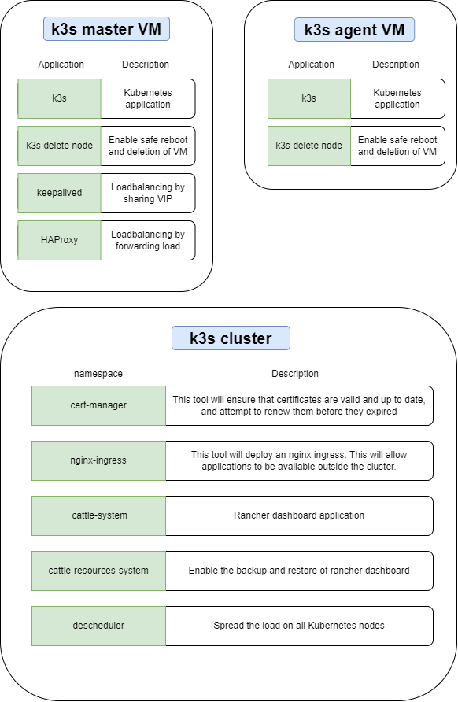

# Zero cost : Terraform & Ansible : HA & Disaster Recovery for Rancher dashboard on Oracle Cloud

Are you hosting your applications on kubernetes ? Is the load distributed across multiple clusters? Do you switch between kubectl contexts often to view and update your application?

Kubernetes is a great choice for orchestrating containers. Rancher Lab has developed a tool to help us manage multi-cluster from both on-premise and in the cloud. The tool focuses on providing reliable and easy ways to access, deploy, audit, backup, upgrade and observe applications on our clusters. 

Within [oracle cloud infrastructure always free services limits](https://www.oracle.com/cloud/free/#always-free), we will explore a way to deploy the Rancher Dashboard at zero cost with high availability and backup & restore capabilities.

## Prerequisites:
* Oracle Cloud Infrastructure paid account. Resources like *Network Load Balancer* are only available on the paid account, and have free service limits.
* S3 storage account
* Own a DNS entry
* Setup a [Reserved Public IP](https://docs.oracle.com/en-us/iaas/Content/Network/Tasks/managingpublicIPs.htm) and redirect a DNS to your public IP
* Knowledge of Kubernetes, Terraform, SSH

## Tools are we going to use:
* [Terraform](https://www.terraform.io/): provision the infrastructure as code
* [Ansible ](https://www.ansible.com/): configuration management and application deployment functionality as code
* [K3S](https://k3s.io/): a lightweight kubernetes distribution design by rancher lab for production load everywhere
* [Rancher dashboard](https://docs.ranchermanager.rancher.io/): a kubernetes dashboard design by rancher lab
* [Nginx ingress](https://kubernetes.github.io/ingress-nginx/): a kubernetes ingress base on nginx
* [Cert manager](https://cert-manager.io/docs/): a tool to manage certificate with letsencrypt

## Do you want to try it now ?

The default settings use the maximum limits provided by the always free services, customize them to fit your needs.

## What infrastructure are we going to deploy ?

In Oracle Cloud infrastructure, we are going to use terraform to deploy a Virtual Cloud Network with two subnets. 
* The first subnet will be public and will have an *Internet Gateway*, it will contain the *Network Load Balancer* and *Oracle Cloud Bastion*.
* The second subnet will be private and will have a *NAT Gateway*, all VMs will be hosted in this subnet. 

We will provide two pools of instances. One for the k3s master nodes and the other one for k3s agent nodes. The VMs will be distributed throughout the data center area to increase availability. Access to these VMs via SSH will only be through an *Oracle Cloud Bastion*.

HTTP and HTTPS will be load balance on k3s agent nodes using the *Network Load Balancer*.

Unfortunately, we couldn't use *Network Load Balancer* to distribute request between k3s master nodes for high availability. The tool is not able to distribute request from and to the same VM. We end up, providing an additional private IP will attach to the first k3s master node. This IP will be shared among k3s master nodes using keepalived. A *dynamic IAM group* and *IAM policy* will allow k3s master nodes to manage the allocation of the shared IP. 

## What application are we going to deploy ?

Oracle cloud added Ansible to the Resource Manager Terraform host. We will use terraform to prepare the inventory and generate a Bastion session to allow connection to the VM.

Ansible will be executed using the terraform local-exec provisionner from a null resource.

The [playbook](install_ansible_playbook.yml) will start by deploying K3S on the machine. Then the first master will be used to deploy applications in the previously generated kubernetes cluster.

## Conclusion
In today's example, we have set up a HA k3s cluster on Oracle Cloud and deploy an application using Terraform and Ansible.

To learn more about the deployed resource, see the following resource:

### Link to GitHub repos:
* [Terraform module for Oracle Cloud Resource Manager](https://github.com/Frantche/oci_ressource_manager_terraform_ansible_rancher_k3s_ha_backup)
* [Ansible collection k3s](https://github.com/Frantche/ansible_collection_k3s)
* [Ansible collection helm_wrapper](https://github.com/Frantche/ansible_collection_helm_wrapper)
* [Ansible role helm nginx](https://github.com/Frantche/ansible_role_helm_nginx)
* [Ansible role helm cert-manager](https://github.com/Frantche/ansible_role_helm_cert_manager)
* [Ansible role helm rancher](https://github.com/Frantche/ansible_role_helm_rancher)
* [Ansible role helm rancher-backup](https://github.com/Frantche/ansible_role_helm_rancher_backup)
* [Ansible role helm descheduler](https://github.com/Frantche/ansible_role_helm_descheduler)
